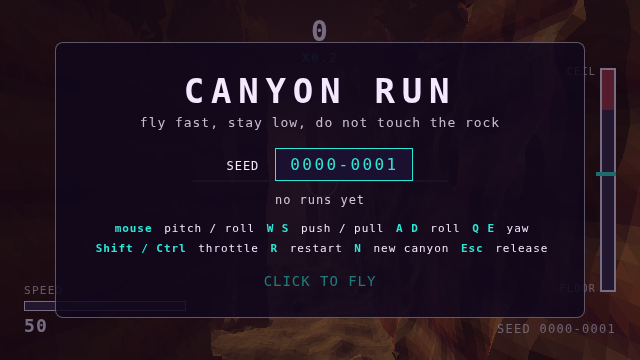
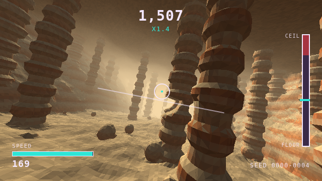

# Canyon Run

A fast, colourful first-person canyon flyer for the browser. You pilot a plane
through an endless, seeded canyon of flat-shaded marching-cubes rock: roll,
pitch, yaw and thrust are yours, the ceiling is not. Survive as long as you can;
slowing down costs points, hugging rock and threading gaps earn them. Six
biomes rotate along the way, each with its own geometry and palette.

Every run is deterministic: a seed plus the per-tick inputs reproduce it bit
for bit on any engine, so replays can be validated and regressions caught by
golden replays and golden frames.

**Play it:** https://helico-tech.github.io/canyon-run/ (deployed from `main` by
GitHub Actions; see `.github/workflows/pages.yml`).




## Install and run

Requires Node 24 and pnpm (via corepack: `corepack enable`).

```
pnpm install       # also installs the git pre-push hook
pnpm dev           # Vite dev server, open the printed URL
pnpm build         # production build to dist/ (any static server can host it)
pnpm preview       # serve dist/
```

Headless tools need Playwright's Chromium once: `pnpm exec playwright install chromium`.

## Play

Click to fly (pointer lock). `#seed=XXXX-XXXX` in the URL shares a canyon; the
start screen's biome select (or `&biome=trench-run`, `cave`, `crystal-spires`,
`lava-rift`, `hoodoo-desert`, `floating-archipelago`, `canyon`) forces a biome
for every special segment. Biomes: canyon, cave, crystal spires, lava rift,
hoodoo desert, floating archipelago, and a Death-Star-style trench run.

| Input | Action |
|---|---|
| mouse | pitch (push forward = nose down) and roll |
| W / S | push / pull |
| A / D | roll |
| Q / E | yaw |
| Shift / Ctrl | throttle up / down |
| R | restart the same seed |
| N | new canyon |
| Esc | release the mouse |

Score accrues every tick at a rate that grows with the square of your speed
factor, doubles when you touch distance to rock and rises with a proximity
streak. Events pay bonuses: CLOSE, SO CLOSE, THREADED, passing a biome GATE, and
DODGED for crossing an adversary station with its body close by. Adversaries are
moving kill volumes in the cross-section of the tube (hoops, blades, presses,
jaws, orbiting shards, bouncing blocks), one set per biome; they never move along
the tube, and a fairness audit proves each one can be passed. Each segment narrows
the canyon, densifies features, raises the speed floor and quickens the adversaries.

## Replays

The run-over panel's **copy replay** puts the run's JSON on the clipboard.

```
node src/cli/replay.ts validate run.json                    # re-simulates; exit 0 only if the score is real
node src/cli/replay.ts run --seed 7 --ticks 1800 --out r.json   # the scripted pilot records a run
```

Load a replay with `?replay=<url>`; the HUD shows a replay badge.

## Headless validation (for agents and CI)

```
pnpm build
pnpm headless -- --seed 1 --frames 300 --every 30 --out runs/seed1
pnpm headless -- --replay tests/replays/seed-1.json --frames 300 --out runs/r1
pnpm headless -- --seed 4 --skip 840 --frames 240 --every 40 --out runs/hoodoo   # deep into segment 1
```

Each run writes per-frame state and frame hashes, PNGs, a labelled contact
sheet, frame statistics and a gate report; the exit code fails when a gate fails
(exposure, colour variety, edge density, temporal change, console errors, and
the browser's sim checksum against Node's). `?test=1` exposes `window.__game`
(`step`, `state`, `setInput`, `loadReplay`, `frameHash`, `readPixel`, …).
See `docs/context/headless-validation.md`.

## Tests

```
pnpm check         # typecheck (app + DOM-free core), lint (zero warnings), format, unit tests
pnpm test:e2e      # build + Playwright: render gates + golden hashes, input, lifecycle, cross-engine replays
pnpm sim:regold    # regenerate golden replays after an intentional sim change (bumps SIM_VERSION)
pnpm headless:golden   # regenerate golden frame hashes after an intentional visual change
```

## Known limitations

All rendering evidence comes from headless SwiftShader on a VM without a GPU;
frame rate and pointer-lock feel on real hardware are unverified (see
`docs/issues/`, which also lists the polish backlog: settings, audio, a wasm
field port, gate visibility, HUD biome name).

## Repository layout

```
src/sim        deterministic flight model, collision, scoring, replay codec (no DOM, no transcendental Math)
src/terrain    hash noise, density field, biomes, marching cubes, chunk builder (same rules)
src/render     three.js adapter: chunks, sky, fog, lights, camera, streaks, shards
src/app        browser wiring: loop, input, HUD, screens, worker client, test mode
src/cli        Node entry points
tools/headless Playwright runner, stats, gates, contact sheets
tests          e2e specs, golden replays and frame hashes
docs           ADRs, spec, work items, issues, domain knowledge, context, research, evidence
scripts        work-item, issue and docs validation scripts; git hooks
```

Start with `docs/specs/2026-09-03-canyon-run-architecture.md` and the ADRs in
`docs/adr/`. `docs/evidence/` holds the headless frames that prove each story.

## Origin

This project was built autonomously by Claude Code from the following prompt,
verbatim. The research reports, decisions, epics, stories and evidence that
came out of it are in `docs/`.

> Okay, I want you to autonomously build a 3d canyon flyer game. The idea is you control a plane going fast through canyon. You can move up down, left right, and increase and decrease thrust. You have an upper ceilig so you can not escape the canyon.
>
> - viewpoint in cockput, but only a simple hud
> - level is procedurally generated
> - flat shaded marching cubes levels, so interesting features possible
> - polygonal, no textures
> - fast paced and colorful
> - roll, pitch, yaw, thrust
> - how long you survive is the score, speed reduction means less points
> - deterministic simulation, so exact controls can be stored and replayed to validate
> - multiple biomes, so maybe not only canyons, but other ones that make sense
>
> You shuold be able to do this autonomously. So find a tech stack that supports rendering in a way that allows you to read and alidate it
> Use tests where needed to keep code robust. No useless TDD if possible. But to avoid regressions.
> You must be able to run it headless as well, for you to control the simulation and generate screenshots.
>
> Extremely fast paced, colourful, deterministic, keyboard/mouse input. For now... desktop/web, but you should do a deepdive on the best tech stack for this. Preferably LOW mem and CPU usage. So no insane large stacks.
>
> Generate evidence of your progress in the repo, add a remote in @/data/repos/ and use git profously. Should be installed/build easuly, and run easily.
>
> Do research with multiple agents for best solutions. Rank them and consolidate into architectural design. Then create the epics, and stories and implement them, autonomously, stpe by step. Until done.

A follow-up asked for this GitHub repository, GitHub Pages deployment and this section.
